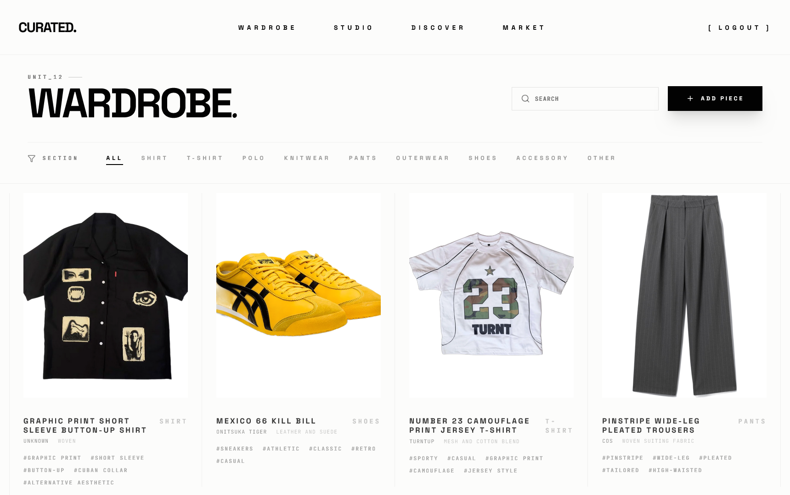
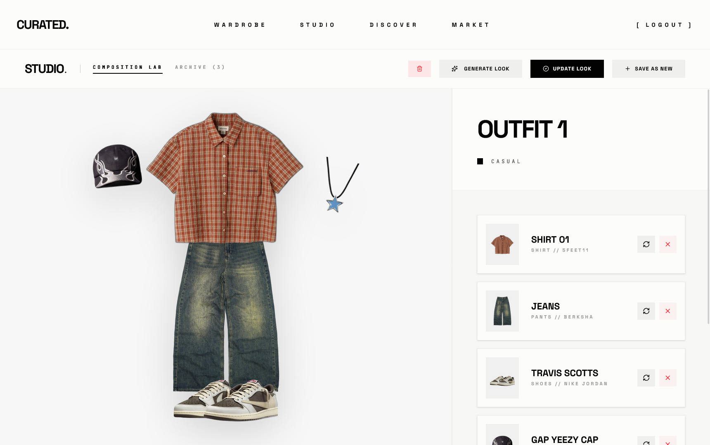
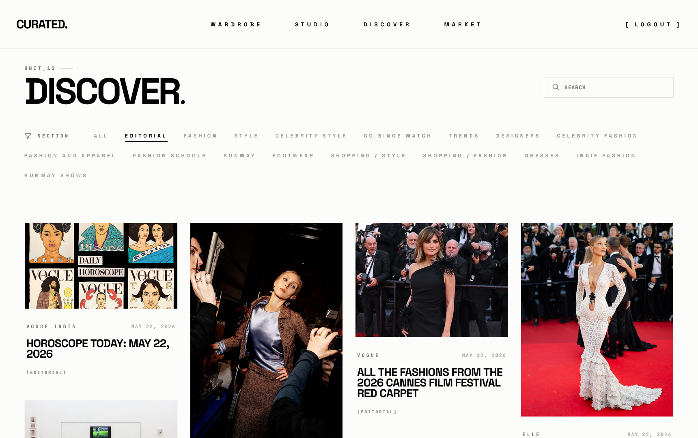
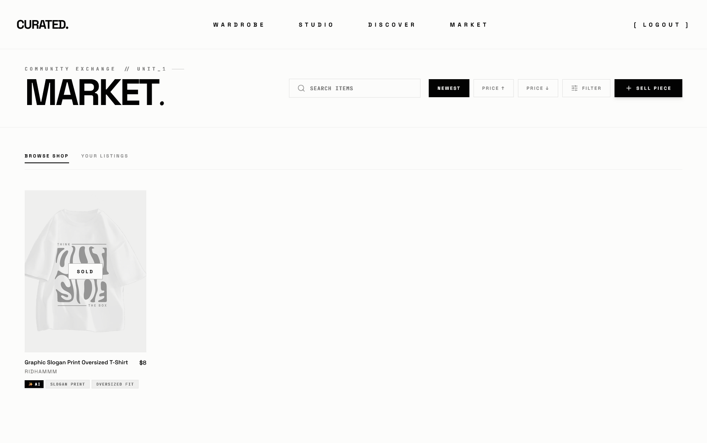

<h1 align="center">CURATED</h1>

<p align="center">
  <strong>An AI-Powered Digital Wardrobe & Peer-to-Peer Resale Marketplace</strong>
</p>

<p align="center">
  
  
  
  
  
</p>


---

## Overview

**Curated** is a high-end, minimalist digital archive and fashion ecosystem. It transforms how users interact with their clothing by merging smart wardrobe management, automated styling curation, and a peer-to-peer resale marketplace into a unified, high-contrast, editorial experience.

Built with the MERN stack, the platform uses AI-assisted categorization, high-speed media hosting, and secure authentication to deliver a premium user experience.

---

## Key Features

- **Smart Wardrobe Archive**: Digitize and organize your wardrobe. Filter items by color, season, brand, or category.
- **AI Auto-Tagging**: Automatically scans uploaded clothing items, detects attributes, and generates tags (powered by Google Vision / AI services).
- **Outfit Studio**: Compose, archive, and curate custom outfit combinations directly from your digital wardrobe.
- **Integrated Marketplace**: List closet items for sale, browse listings from other users, and trade securely in a peer-to-peer fashion exchange.
- **Inspiration Feed**: A curated stream of global fashion trends. Save inspiring looks to your mood board and link back to wardrobe items.
- **Media Delivery**: Real-time image optimization, resizing, and hosting powered by Cloudinary.

---

## Project Screenshots

### Smart Wardrobe
Digitally track and organize your clothing collection with deep filtering.
<p align="center">
  
</p>

### Outfit Studio
The creative dashboard to combine, experiment, and archive outfit fits.
<p align="center">
  
</p>

### Inspiration Feed
Discover global fashion trends, collect ideas, and build your digital aesthetic.
<p align="center">
  
</p>

### Marketplace
A connected peer-to-peer resale environment to buy and sell clothes directly.
<p align="center">
  
</p>

---

## Technical Architecture

```
                 +-----------------------+
                 |     React Frontend     |
                 |      (Vite + CSS)     |
                 +-----------+-----------+
                             |
                             |  HTTPS / REST APIs
                             v
                 +-----------------------+
                 |      Express API      |
                 |     (Node.js Server)  |
                 +------+-----------+----+
                        |           |
                        |           |
       Save Metadata    v           v    Upload Images
                 +------+---+   +---+--------+
                 | MongoDB  |   | Cloudinary |
                 | Database |   |   Media    |
                 +----------+   +------------+
```

---

## End-to-End Workflow

1. **Upload**: User uploads clothing photo -> sent to Express backend.
2. **Process**: Image uploaded to **Cloudinary** -> URL returned -> AI tags generated.
3. **Store**: Clothing metadata & image URL saved in **MongoDB**.
4. **Style**: User creates combinations in **Outfit Studio**.
5. **Trade**: Items from digital wardrobe can be listed on the **Marketplace** with one click.

---

## Tech Stack

- **Frontend**: React, React Router, Vite, Vanilla CSS (OKLCH color system)
- **Backend**: Node.js, Express.js, JWT, Multer
- **Database**: MongoDB (Mongoose ORM)
- **Cloud Services**: Cloudinary (Image Hosting & Optimization)
- **Icons**: Lucide React

---

## Project Structure

```text
curated/
├── assets/
│   └── screenshots/          # Application screenshots & hero images
├── client/
│   ├── public/               # Static public assets
│   └── src/
│       ├── assets/           # Local client-side assets
│       ├── components/       # Reusable React components
│       ├── context/          # State management context
│       ├── pages/            # App pages (Home, Wardrobe, Studio, etc.)
│       └── services/         # API integration services
└── server/
    ├── config/               # Database & service configurations
    ├── middleware/           # Auth and upload middlewares
    ├── models/               # MongoDB Mongoose schemas
    └── routes/               # API endpoint routing
```

---

## Installation & Setup

### Prerequisites
- Node.js (v18+ recommended)
- MongoDB account or local server instance
- Cloudinary account for asset uploads

### Step 1: Clone the Repository
```bash
git clone https://github.com/SehajveerSingh2005/curated.git
cd curated
```

### Step 2: Configure Environment Variables
Create a `.env` file in the `server/` directory and configure the following variables:
```env
PORT=5000
MONGO_URI=your_mongodb_connection_string
JWT_SECRET=your_jwt_signing_secret
CLOUDINARY_CLOUD_NAME=your_cloudinary_cloud_name
CLOUDINARY_API_KEY=your_cloudinary_api_key
CLOUDINARY_API_SECRET=your_cloudinary_api_secret
```

### Step 3: Install Backend & Frontend Dependencies
```bash
# Install server dependencies
cd server
npm install

# Install client dependencies
cd ../client
npm install
```

### Step 4: Run Development Servers
```bash
# Start backend server (runs on port 5000)
cd server
npm start

# Start frontend application (runs on http://localhost:5173)
cd ../client
npm run dev
```

---

## Recommended Pull Request Git Workflow

To collaborate cleanly, team members should follow this Pull Request workflow:

1. **Pull latest changes**:
   ```bash
   git checkout main
   git pull origin main
   ```
2. **Create a feature branch**:
   ```bash
   git checkout -b feature/your-feature-name
   ```
3. **Stage and Commit**:
   ```bash
   git add .
   git commit -m "feat: implement your feature description"
   ```
4. **Push to Remote**:
   ```bash
   git push origin feature/your-feature-name
   ```
5. **Open Pull Request**: Go to GitHub, click **Compare & pull request**, set `base: main`, write details, and submit for review.

---

## Contributors

- **Pratham Jindal**
- **Ridham Garg**
- **Sehajveer Singh**
- **Tushar Chaudhary**

---

*Curated is built as part of the ETE project submission for the Department of Computer Science and Engineering, Chitkara University, Punjab.*
